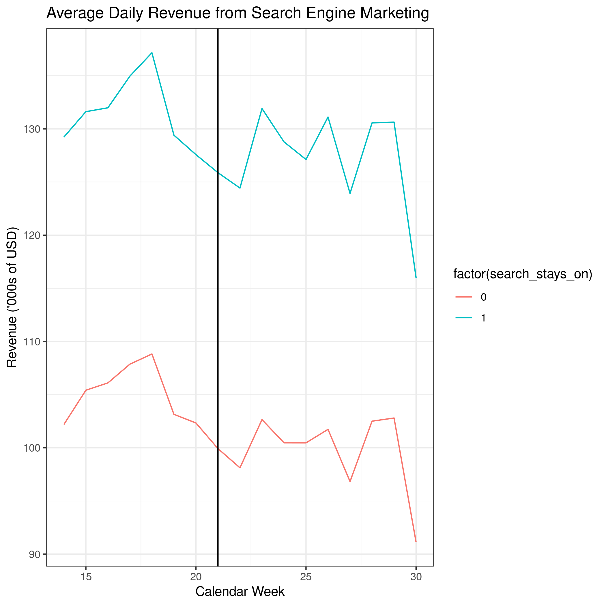

## Motivation

Last week, we reviewed linear regression - the workhorse model of a Marketing Analyst's toolkit.
When linear regression is further combined with the ability to conduct experiments or find 'natural experiments', the analyst's toolkit is further strengthened through their ability to make **strong** causal claims about the effect of marketing interventions through the use of the Difference-in-Differences (DiD) methodology.

In this tutorial you will apply the DiD methodology to get first hand experience with these tools.
We will focus both on how to implement them in `R` and how to correctly interpret the results.
The empirical example demonstrates how to use the DiD toolkit to evaluate the effectiveness of search engine marketing on sales revenue of an online company.

## Learning Goals

By the end of this tutorial you will be able to:

1. Estimate treatment effects of a marketing intervention using difference in difference estimates from differences in group averages.
2. Estimate treatment effects of a marketing intervention using difference in difference estimates from linear regression.
3. Critically evaluate the assumptions required for difference in difference estimates to be valid.
4. Correctly interpret difference in difference regression estimates.
5. Display difference in difference estimates in a regression table and coefficient plot.

## Instructions to Students

These tutorials are **not graded**, but we encourage you to invest time and effort into working through them from start to finish.
Add your solutions to the `lab-03_answer.Rmd` file as you work through the exercises so that you have a record of the work you have done.

Obtain a copy of both the question and answer files using Git.
To clone a copy of this repository to your own PC, use the following command:

```{bash, eval = FALSE}
$ git clone https://github.com/tisem-digital-marketing/smwa-lab-03.git
```

Once you have your copy, open the answer document in RStudio as an RStudio project and work through the questions.

The goal of the tutorials is to explore how to "do" the technical side of social media analytics.
Use this as an opportunity to push your limits and develop new skills.
When you are uncertain or do not know what to do next - ask questions of your peers and the instructors on the class Slack channel `#lab-03-discussion`.

\newpage

## Exercise 1: Difference in Differences

In 2014, [Thomas Blake](http://www.tomblake.net/), [Chris Nosko](https://www.linkedin.com/in/cnosko) and [Steve Tadelis](https://faculty.haas.berkeley.edu/stadelis/) published a study that examines the revenue impact of search engine marketing.^[
  Read the paper [here](https://onlinelibrary.wiley.com/doi/abs/10.3982/ECTA12423).
  It's a bit of a timeless classic in my opinion.
]
Essentially, they worked with eBay to run controlled experiments and turn off search engine marketing in certain parts of the USA and examine the effects on revenue in these regions compared to other regions where marketing was kept on.
eBay (like many other companies) intensively used search engine marketing by bidding on different keywords on Google's [AdWords platform](https://en.wikipedia.org/wiki/Google_Ads).
<!-- The working assumption at the time was that these ads placed on Google's Search and non-search websites steer consumers to a company and increase sales (and thus revenue). -->

For 8 weeks following May 22nd, 2012, eBay stopped using search engine marketing in a treatment group of 65 out of 210 Designated Market Areas in the USA.^[
  A DMA is a region in the USA where the population receives the same (or similar) TV and radio offerings, and internet content.
]
eBay then tracked the revenues in each DMA (treatment and control) using the shipping address of customers.
The question Blake, Nosko and Tadelis wanted to answer was whether turning off search engine marketing changed eBay's revenue. 
We want to replicate their analyses using a modified version of their original data.^[
  [Matt Taddy](https://www.linkedin.com/in/matt-taddy-433078137) makes this data available as part of his book [Business Data Science](http://taddylab.com/BDS.html). 
  The data has been scaled and translated so that eBay's actual revenues remain unknown, but the transformed data give similar results to the analysis on real data.
  Any effect we find in our analysis will look very similar to the original paper.
]

To gain access to the data, run the following code to download it and save it in the file `data/paid_search.csv`:

```{r, cache= TRUE}
url <- "https://raw.githubusercontent.com/TaddyLab/BDS/master/examples/paidsearch.csv"
# where to save data
out_file <- "data/paid_search.csv"
# download it!
download.file(url, destfile = out_file, mode = "wb")
```

You might need to use the following `R` libraries throughout this exercise:^[
    If you haven't installed one or more of these packages, do so by entering `install.packages("PKG_NAME")` into the R console and pressing ENTER.
]

```{r, eval = TRUE, message=FALSE, warning=FALSE}
library(readr)
library(dplyr)
library(tidyr)
library(lubridate)
library(fixest)
library(broom)
library(ggplot2)
library(modelsummary)
```

1. What is search engine advertising?
  Explain the mechanisms through which it might ultimately influence sales revenue.

Search engine advertising is a form of internet advertising: paid search advertising which is the largest investing format by revenue. Google Inc. is the leading SEM provider worldwide.
As Blake, Nosko and Tadelis argue, measuring a causal relationship between Internet-advertising expenditures and sales remains a serious challenge. They believe that, besides the advertiser's campaign, the amount spent on internet marketing is a function of the behavior and intent of customers as well.

Ultimately, sales revenue can be influenced (increased) by search engine advertising accordingly:
- higher click-through-rate to your website of existing consumers or potential consumer that have already got to know the company/product(s)
- potential new customers gained by appearing at the top of the search list
--> Here, brand paid search links simply intercepts consumers at their last point in their navigational process
- drawing potential new customers by their interest due to targeting their ads to the activity users are engaged in
- more new users signing up to the company's website

  
2. Why would it be difficult to estimate the effectiveness of search engine advertising with purely observational data?

According to Blake, Nosko and Tadelis, it is very difficult to measure and estimate the search engine advertising with purely observational data, because of severe endogeneity as well as the influence of behavior and intent of consumers on internet marketing expenditure as this remains unmeasured. Strong assumptions must be made to validate the findings with these expectations.

3. Explain why the experiment that Blake, Nosko and Tadelis runs allows them to avoid the issues in (2), and accurately measure the causal effect of search engine advertising on sales.

Blake, Nosko and Tadelis overcome the endogeneity problem with their controlled experiments. In their experiments, they remove the search advertising in 65 of 210 DMAs in the US, which removes the endogeneity problem there as people will not have found the brand's names in ads, but only by organic search results. The endogeneity problem arises with search engine advertising, because the ads simply appear above the organic search results, also showing the brand. Therefore, the customer would have found information on the brand anyhow.

With some conceptual knowledge under our belt, let's get our hands dirty.
We will start by cleaning up the data a little and then producing some summary plots to build up an understanding of the main patterns.

4. Load the data into `R` naming the data `paidsearch`.

```{r}
paidsearch <- read_csv("data/paid_search.csv")
```


5. What are the column names in the data? 
If you find that one of the column names in the data has whitespace in it, you will want to replace the whitespace with underscores, "`_`"

```{r}
glimpse(paidsearch)

paidsearch <- paidsearch %>%
  rename("search_stays_on" = `search stays on`)

```


6. Revenue is reported in USD.
Modify the `revenue` variable so that the new values are in '000s of USD.

```{r}

paidsearch <- paidsearch %>%
  mutate(revenue = revenue/1000)


```


To draw some descriptive plots we will need the `date` variable to be formatted as a date (rather than as a character string).
Run the following code to make this conversion:

```{r}
# Uncomment these lines by removing the #'s
# in front of the code when you get to this point
paidsearch <-paidsearch %>%
  mutate(date  = as_date(date, format = '%d-%b-%y'))
```


7. Compute the average revenue per DMA each day.
Plot the data so that you can see how average revenue evolves over time.

```{r}

summary(paidsearch$date)
#date range: 4th of april until & including 22nd of July 2012
paidsearch %>%
  distinct(date) %>%
  count(date)
#113 rows = 113 days in dataset

mean_rev <- paidsearch %>%
  group_by(dma) %>%
  mutate(avg_rev_dma = mean(revenue)) %>%
  ungroup()

mean_rev %>%
  group_by(date) %>%
  print(avg_rev_dma)

#Average revenue per dma
paidsearch <- paidsearch %>%
  group_by(dma) %>%
  mutate(avg_rev_dma = mean(revenue)) %>%
  ungroup()

#Average revenue per day
paidsearch <- paidsearch %>%
  group_by(date) %>%
  mutate(avg_rev_date = mean(revenue)) %>%
  ungroup()

#Plot the data over time
  
  paidsearch %>%
  ggplot(aes(x = date, y = avg_rev_date, colour = factor(search_stays_on))) +
  geom_line() +
  labs(x = "Date (Months)",
       y = "Revenues ('000s in USD)") +
  ggtitle("Average Daily Revenue from Search Engine Advertising") +
  theme_bw()

```


The plot in (7) likely shows a lot of cyclicality within each week.
This makes it hard to visualize broader patterns or differences across groups. 
We will compute averages for each calendar week to smooth out the cyclicality within each week.
To make this easier, run the following code to extract the calendar week from each date in the data:

```{r}
# Uncomment these lines by removing the #'s
# in front of the code when you get to this point
paidsearch <-
    paidsearch %>%
    mutate(calweek = week(date))
```


8. Compute the average daily revenue per calendar week for DMAs in which eBay turn off their search advertising and for DMAs that leave search advertising turned on.
The resulting dataset should have 34 observations, 17 where `search_stays_on =1` and 17 where `search_stays_on =0`.

```{r}

paidsearch <- paidsearch %>%
  group_by(calweek) %>%
  mutate(avg_rev_calweek = mean(avg_rev_date)) %>% #average daily revenue per calender week for all DMAs separately
  ungroup()

output <- paidsearch %>%
  select(search_stays_on, avg_rev_calweek) %>%
  distinct(avg_rev_calweek, search_stays_on) %>%
  group_by(search_stays_on)

```


9. Plot the average daily revenue per week for`search_stays_on =1` and  `search_stays_on =0`.
Add a vertical line denoting where the experiment begins (22 May 2012).
Your final plot should resemble this one:

```{r, echo = FALSE, eval = TRUE, fig.align="center", out.width="75%"}

```


```{r}

paidsearch %>%
  ggplot(aes(x = calweek, y = avg_rev_calweek, color = factor(search_stays_on))) +
  geom_line(aes(colour = factor(search_stays_on))) + #I can't get the lines to split based on factor(search_stays_on)
  geom_vline(xintercept = 21) +
  ggtitle("Average Daily Revenue from Search Engine Advertising") +
  labs(x = "Calender Week",
       y = "Revenues ('000s in USD)") +
  theme_bw()

```


10. Is average revenue different for DMAs that have turned off search advertising compared to those where it remains on?
Why might this be the case?

It slightly is different just after the search advertising has been turned off, however it returns to be equal a few weeks later.
Therefore, there seems to be a short term effect but no long term effect of turning search advertising on or off, based on this graph.

The customers who are in de DMA where the search advertising has been shut off, don't encounter any directed search advertising anymore. However, these are not the only touch points, consumers have with certain brands. In the long term, they will be reminded or directed towards a certain brand anyhow, via offline advertising or WOM, or anything else.

11. From the graph above, can you "eye-conometrically" see any effect of turning off search engine ads?^[
  All "clean" (well-executed) Difference in Difference papers should produce a plot where you can visually assess what is going on.
  If you don't see one, its could a warning sign that whatever comes next is an artifact of the statistical model, rather than the experiment (or, if published in a journal *maybe* an editor asked to suppress the figure to save space).
]

From the graph-above I can see a short-term effect of which not yet known whether it is significant.
The revenues are a bit more flat, less spikey, for the areas where the search engine advertising had been shut off. However, on the longer term (after a few weeks already), the revenues are very much alike.


Now we will go back to working with the full dataset `paidsearch`.

12. Create a new variable `treatment` that takes the value 1 if search engine advertising is switched off, and 0 if search engine advertising stays on.
Also rename the variable `treatment_period` to `after`.

```{r}

#rename the variable treatment_period to after:
paidsearch <- paidsearch %>%
  rename(after = treatment_period)

#create a new variable treatment

paidsearch %>%
  mutate(treatment = case_when(
    search_stays_on==1 ~ TRUE,TRUE ~ FALSE))

# Create a new variable `treatment` that takes the value 1 if search engine advertising is switched off, and 0 if search engine advertising stays on
paidsearch <- paidsearch %>%
  mutate(treatment = case_when(
    search_stays_on==0 ~ TRUE,TRUE ~ FALSE))

#paidsearch <- paidsearch %>%
#  select(-`as.numeric(paidsearch$treatment)`)

paidsearch <- paidsearch %>%
  mutate(treatment = as.numeric(treatment))


```


13. We can compute a Difference in Difference estimate from a set of group means:

$$
\hat{\delta}_{DiD} = (\bar{y}_{after=1}^{treat =1} - \bar{y}_{after=0}^{treat =1}) - (\bar{y}_{after=1}^{treat =0} - \bar{y}_{after=0}^{treat=0})
$$

where $\bar{y}$ is average revenue, `after=1` denotes dates after the treatment starts, `after=0` denotes dates before the treatment starts, `treat=1` denotes DMAs that where part of the treatment group and `treat=0` denotes DMAS that where part of the control group.
Thus $\bar{y}_{after=1, treat =1}$ is average revenue for DMAs in the treatment group for the period after the treatment has begun.

Compute each of these four $\bar{y}$'s.

```{r}

means <- paidsearch %>%
  group_by(treatment, after) %>%
  summarize(revenue=mean(revenue)) %>%
  ungroup()

print(means)

did_table <- means %>%
  pivot_wider(names_from = after,
              values_from = revenue)

print(did_table)

```


14. Use the averages you computed in (13) to the treatment effect of turning off search engine advertising, i.e. $\hat{\beta}_{DiD}$.

```{r}

bef_after_untreated <- filter(means, treatment==1,after==1)$revenue -
  filter(means, treatment==1, after==0)$revenue

bef_after_treated <- filter(means, treatment==0,after==1)$revenue -
  filter(means, treatment==0, after==0)$revenue

did <- bef_after_treated - bef_after_untreated

print(paste("Diff in Diff EstimateL ", did))

```


15. Interpret the effect you computed from the point of view of a marketing analyst working at eBay. Is it large from a marketing viewpoint?

The effect size estimated is about 1.1, which from a marketing standpoint is large as it exceeds the cutoff of 0.8

16. We rarely see analytical work use this difference in averages approach.
Can you explain why that might be the case?

It is a relatively young way of analysis

17. Estimate a linear regression that computes the equivalent Difference-in-Difference estimate as (13).

```{r}

reg_did <- lm(revenue ~ after*treatment, data = paidsearch)

tidy(reg_did, conf.int = TRUE)

```


18. Is $\hat{\beta}_{DiD}$ statistically significant? How can you tell?

The DiD estimate is not statistically significant at the 5% nor the 10% level (p-val = .864 > .05) and the confidence intervals are -13.61 and 11.42 on an estimate of -1.094 which is too large.

19. We can repeat the estimation in (17) using $\log(revenue)$ rather than $revenue$. Why might we want to do that?
Run this regression and interpret the magnitude of the treatment effect.

```{r}

did_reg_log <- lm(log(revenue) ~ after*treatment, data=paidsearch)

tidy(did_reg_log, conf.int = TRUE)

```


20. What standard errors were computed with your regression estimates so far?
Are these appropriate? 
If not, adjust them to compute what you believe to be more conservative (and unbiased) standard error estimates.

```{r}

# The standard errors of the first regression run (regular revenues), were way too big as they all exceeded 2.6.
# However, the standard errors or the second regression (log(revenues)) were already a lot better as all errors preceded 0.036.

check_se <- paidsearch %>%
  mutate(residuals = resid(did_reg_log),
         fitted_val = predict(did_reg_log))

check_se %>%
  ggplot(aes(x = fitted_val,
             y = residuals,
             alpha = 0.35)) +
  geom_point() +
  theme_bw() +
  theme(legend.position = "none")

#They're very clustered

tidy(did_reg_log,se = "standard" , conf.int = TRUE)

library(estimatr)
did_reg_log1 <- lm_robust(log(revenue) ~ after*treatment,
                          data=paidsearch)

tidy(did_reg_log1, conf.int = TRUE)
#Heteroskedasticity assumed changed rarely anything


did_reg_log2 <- lm_robust(log(revenue) ~ after * treatment,
                   clusters = dma,
                   data = paidsearch)

tidy(did_reg_log2, conf.int = TRUE)
#This actually decreases the std. error's magnitude of the estimate of interest


```

21. Do you think fixed effects should be added into the regression? Why?
Add them to your regression and report the results.

```{r}

# I think fixed effects should be added for time as well as the fixed effects of dma


did_reg_log3 <- feols(revenue ~ after*treatment + dma + date |
                        dma + date,
                      data = paidsearch)
#Errors reporting on after and treatment to show collinearity

tidy(did_reg_log3, conf.int = TRUE)

```

22. Construct a regression table that presents three or more of the regressions you have run.
Make it look presentable, such that you could use it in a presentation to eBay stakeholders if you were in the shoes of Blake, Nosko and Tadelis.

```{r}
# Write your answer here
```

23. Construct a coefficient plot that presents the difference in difference estimates of three or more of the regressions you have run.
Make it look presentable, such that you could use it in as an alternative to the regression table in presentation to eBay stakeholders if you were in the shoes of Blake, Nosko and Tadelis.

```{r}
# Write your answer here
```

24. A crucial assumption for the Difference-in-Differences estimate to accurately measure the effect of turning off search engine ads is the presence of parallel trends.
What is the parallel trends assumption and why do we need it?
Does it appear satisfied in our data?

```{r}
# Write your answer here
```


25. Can we definitively conclude from the results above that search engine marketing does not pay off? Explain your answer.

**Write your answer here**
